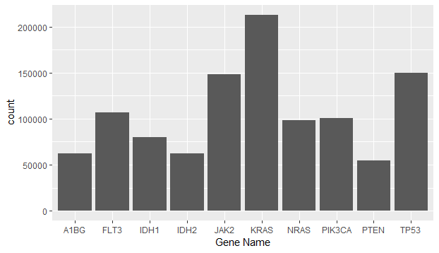
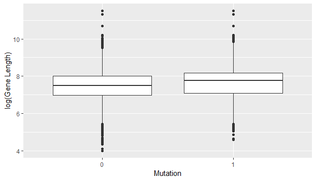
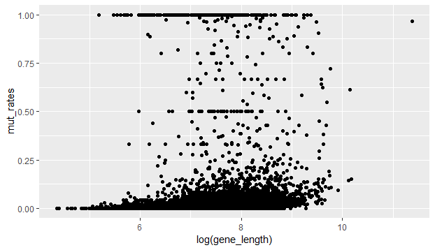

# `BCB420.2019.COSMIC`

&nbsp;

###### Matthew McNeil, Department of Biochemistry, University of Toronto, Canada. 

----

<!-- TOCbelow -->
1. About this package:<br/>
&nbsp;&nbsp;&nbsp;&nbsp;1.1. What it is ...<br/>
2. COSMIC Data ...<br/>
3. Develop<br/>
4. Name Validation<br/>
5. Data Analysis<br/>
6. Notes<br/>
7. Acknowledgements<br/>
<!-- TOCabove -->

----


# 1 About this package:

## 1.1 What it is ...

This package takes targeted screen data from the COSMIC database and transforms it to generate mutation rates for every gene present, by both gene and by tissue type. Additionally a sample data set is created based on the lysosome system created by (Corona & Jackson, 2018).

```
 --BCB420.2019.COSMIC.GEO/
   |__.gitignore
   |__.Rbuildignore
   |__BCB420.2019.COSMIC.GEO.Rproj
   |__data/
      |__Example.tsv
   |__DESCRIPTION
   |__dev/
      |__functionTemplate.R
      |__rptTwee.R
   |__images/
      |__boxplot.png
      |__gene_length.png
      |__Rplot01.png
      |__Top_genes.png
   |__inst/
      |__extdata/
         |__test_lseq.dat
      |__scripts/
         |__Analysis.R
         |__scriptTemplate.R
   |__LICENSE
   |__NAMESPACE
   |__R/
      |__load.R
      |__temp.R
      |__zzz.R
   |__README.md
   |__rpt.Rproj
```

----

# 2 COSMIC Data ...

COSMIC's targeted screens data contains information on targeted screen of the genes present in humans, including negatives. This allows us to generate mutation rates from the presence or absence of a mutation in each test case. Here they indicate which mutation occured in the CDS and aA sequence in different columns, leaving it blank if no mutation was found. Additionally they give use the tissue type the sample was obtained from allowing for further analysis.

&nbsp;
# 3 Downland

Navigate to the download section of the [COSMIC webpage](https://cancer.sanger.ac.uk/cosmic/download) and obtain the targeted screens data file. Save in the ./data folder of this repo and unzip it.

Additionally, COSMIC automatically intends to use the HGNC symbols as its gene identifiers, however we will use the full list of HGNC symbols from genenames.org to fully validate the names.
&nbsp;

# 4 Name Validation

```
# Uses the readr and dplyr package to quickly load the large file
if (! requireNamespace("readr")) {
  install.packages("readr")
}
if (! requireNamespace("dplyr")) {
  install.packages("dplyr")
}
# File path generated from data download
mut_filename <- "./data/CosmicCompleteTargetedScreensMutantExport.tsv"

# Select only relevant column to not over occupy memory once it is read in
colTypes <- readr::cols_only(
  `Gene name` = col_character(),
  `Gene CDS length` = col_double(),
  ID_sample = col_double(),
  ID_tumour = col_double(),
  `Mutation ID` = col_character(),
  `Mutation CDS` = col_character(),
  `Primary site` = col_character()
)

# Read in official HGNC names
hgnc <- readr::read_tsv("./data/hgnc.tsv")
# Read in data frame and rename columns for easier use
mut <- readr::read_tsv(mut_filename, col_types = colTypes)
mut <- dplyr::rename(mut, Gene = `Gene name`, SampleID = ID_sample,
              Mutation = `Mutation CDS`, Site = `Primary site`)
```
Now the our data is loaded we want to inspect the names given by the original database to ensure they match currently used HGNC terms. First we will try to see how many match naturally.
```
# All genes in the database have names, good
sum(is.na(mut$Gene)) # 0
# Look at the gene names individually so we don't waste time and memory on duplicates
HGNC <- unique(mut$Gene)
# Check to see how many are correct from the on set
sum(HGNC %in% hgnc$`Approved symbol`)/length(HGNC) # [1] 0.7335692

# Now let's have a look at some of the ones we missed
head(HGNC[!(HGNC %in% hgnc$`Approved symbol`)])
#[1] "C14orf37"                 "TCEA1_ENST00000521604"    "MAPKAPK5_ENST00000202788"
#[4] "WHSC1"                    "C3orf58"                  "MESDC2"           
# We see that some of these are outdated terms, eg WHSC1, while others are using _ to abridge different gene naming conventions
# We will deal with both of these issues in the following steps

# We will create a matching data frame to easily replace our gene names in the original data set we will be dealing with later
matchTable <- data.frame(original = HGNC, stringsAsFactors = F)
matchTable$Replace <- NA
matchTable$Replace[HGNC %in% hgnc$`Approved symbol`] <- HGNC[HGNC %in% hgnc$`Approved symbol`]

```

First we will deal with cases where an underscore and a second ID was added, keeping the first one listed, which corresponds to the HGNC gene ID
```
missing <- which(!(HGNC %in% hgnc$`Approved symbol`))

Names_ <- sapply(missing, function(x) strsplit(HGNC[x], "_")[[1]][1])
sel <- Names_ %in% hgnc$`Approved symbol`
matchTable$Replace[missing[sel]] <- Names_[sel]
mean(is.na(matchTable$Replace)) # [1] 0.1172932
```

Next we will search the old symbols for matches. In cases where a single gene ID matches multiple old symbols, the first one listed is taken arbitrarily.

```
# Find the genes which still haven't been matched
missing <- which(is.na(matchTable$Replace))

# Find which current gene names they match to a previous name
previous <- sapply(missing, function(x) grep(HGNC[x], hgnc$`Previous symbols`)[1])
# Finds the remainingNA's for easy resetting over the large group
reset <- which(is.na(previous))
# Changes NA to 1 so that matchTable$Replace can be easily subset
previous[is.na(previous)] <- 1
# Add gene names to replacement table
matchTable$Replace[missing] <- hgnc$`Approved symbol`[previous]
# Reset those which couldn't be found to NA
matchTable$Replace[reset] <- NA
mean(is.na(matchTable$Replace)) #[1] 0.04913755
```
Over 95% of genes in the data base have been identified, great. This is ready for matching back into the original data so that we may begin some analysis.
```
mut$newSymbol <- matchTable$Replace[match(mut$Gene, matchTable$original)]
```

&nbsp;

----

# 5 Data Analysis

First let's transform the Mutation column into binary whether there was a mutation or not
```
mut$Mutation <- ifelse(is.na(mut$Mutation), 0, 1)
```

Now let's see which genes are most common in our data set with a bar graph.
```
top_genes <- sort(table(mut$newSymbol), decreasing = T)[1:10]
x <- mut$newSymbol[mut$newSymbol %in% names(top_genes)]
ggplot() + geom_bar(aes(x = x)) + xlab("Gene Name")
```


We can see that KRAS is by far the most common, something that makes perfect sense given that it is a common drug target and a known cancer driver. Therefore it makes sense that it would be frequently inspected for mutation rates.

Looking at a box plot of gene length and mutation presence we see that those with mutations seem to be slightly longer.


Next we want to look at the effect gene length has on the mutation rate. We will perform a quick graph then perform weighted linear regression on the mutation rates and average gene lengths, since some may become longer or shorter due to cancer mutations.
```
# Finds mutation rates for each gene
mut_rates <- tapply(mut$Mutation, mut$newSymbol, mean)
# Finds average length of each gene for each cancer
gene_length <- tapply(mut$`Gene CDS length`, mut$newSymbol, mean)
# Number of instances of each gene
counts <- table(mut$newSymbol)

ggplot() + geom_point(aes(x = log(gene_length), y = mut_rates))

# Double checking that the gene names match up
which(!(names(counts)== names(gene_length)))
#Creating the model to check significance
model <- lm(mut_rates ~ log(gene_length), weights = counts^(1/2))
```


As well, the model showed that the gene_length was a significant indicator of mutation rate, with longer genes being more likely to be mutated.
&nbsp;

# 6 Sample data set

For our sample data set, we checked how many were present in the actual data set:
```
> sum(gene_set %in% mut$newSymbol)
#[1] 75
```
Out of a total of 85 genes, we will proceed with this number. We then transformed for mutation rates by gene and by site type allowing us to inspect the mutation rates for different genes in each type of cell.
```
gene_set <- c("AMBRA1", "ATG14", "ATP2A1", "ATP2A2", "ATP2A3", "BECN1","BECN2",
              "BIRC6", "BLOC1S1", "BLOC1S2", "BORCS5", "BORCS6", "BORCS7", 
              "BORCS8", "CACNA1A", "CALCOCO2", "CTTN", "DCTN1", "EPG5",                     "GABARAP","GABARAPL1", "GABARAPL2", "HDAC6", "HSPB8", "INPP5E", "IRGM", 
              "KXD1", "LAMP1", "LAMP2", "LAMP3", "LAMP5", "MAP1LC3A", "MAP1LC3B", 
              "MAP1LC3C", "MGRN1", "MYO1C", "MYO6", "NAPA", "NSF", "OPTN", 
              "OSBPL1A", "PI4K2A", "PIK3C3", "PLEKHM1", "PSEN1", "RAB20", "RAB21", 
              "RAB29", "RAB34", "RAB39A", "RAB7A", "RAB7B", "RPTOR", "RUBCN", 
              "RUBCNL", "SNAP29", "SNAP47", "SNAPIN", "SPG11", "STX17", "STX6", 
              "SYT7", "TARDBP", "TFEB", "TGM2", "TIFA", "TMEM175", "TOM1", 
              "TPCN1", "TPCN2", "TPPP", "TXNIP", "UVRAG", "VAMP3", "VAMP7", 
              "VAMP8", "VAPA", "VPS11", "VPS16", "VPS18", "VPS33A", "VPS39", 
              "VPS41", "VTI1B", "YKT6")

subset <- mut[mut$Gene %in% gene_set,]
transform <- as.data.frame(tapply(subset$Mutation, list(subset$Gene, subset$Site), mean))
transform$gene <- rownames(transform)

plotable <- tidyr::gather(transform, "Site", "Ratio", 1:39,
                          na.rm = T)

ggplot(data = plotable, aes(x = gene, y = Ratio, color = Site)) +
  geom_point() 
```
The graph produced is:


All remaining generating code can be found in the Analysis.R script. Additionally the transformed example gene file can be found in the data folder.
&nbsp;


# 7 Acknowledgements

Thanks to Dr. Boris Steipe for providing the template for this package generated.

&nbsp;

&nbsp;

<!-- END -->
